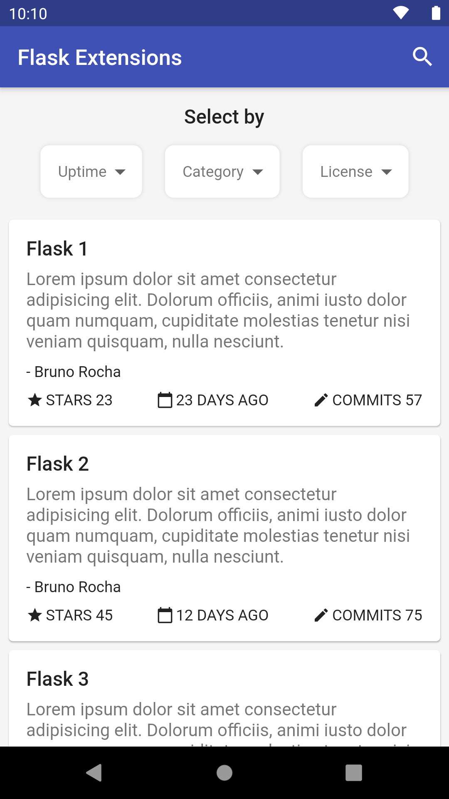
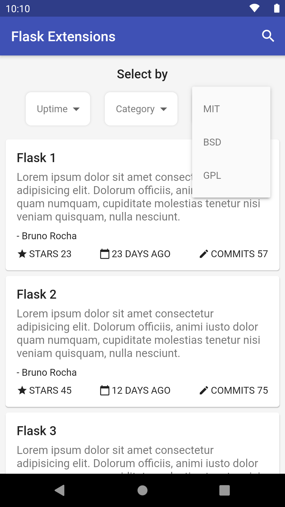

# Flask Extensions

Mobile app of FlaskExtensions.com (Concept).

|                                |                                |
| :----------------------------: | :----------------------------: |
|  |  |
|                                |                                |


## Como rodar o projeto

Primeiro você precisa clonar o repositório:

```sh
git clone https://github.com/robsonsilv4/flask_extensions.git flask_extensions
```

Agora basta entrar na pasta do projeto e baixar os pacotes:

```sh
cd flask_extensions
flutter packages get
```

E rodar no seu dispositivo:

```sh
flutter run
```

---

## Como gerar o instalador

Para gerar os instaladores, basta estar na pasta do projeto e rodar o seguinte comando:

```sh
flutter build apk --split-per-abi
flutter install # para instalar no dispositivo ou emulador
```

Os arquivos gerados ficam em:

```sh
flask_extensions/build/app/outputs/apk/release/...
```